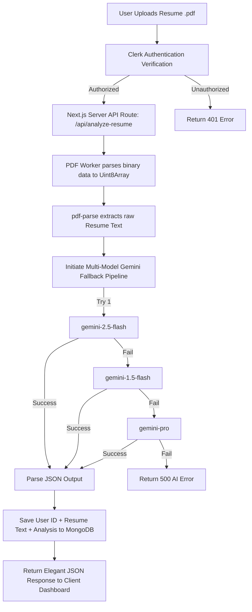

# Technical Architecture & Design Document: CareerCopilot AI

This document provides a comprehensive A-to-Z breakdown of the **CareerCopilot AI** project, detailing **what** technologies are used, **why** they were chosen (logical reasoning), and **how** the system handles the resume parsing, AI analysis, data persistence, and security flows.

---

## 🛠️ Complete Tech Stack & Logical Selection

Below is the complete stack selected for **CareerCopilot AI** along with the precise technical reasoning behind each decision:

| Technology | What We Used | Why We Used It (Logical Reason) |
| :--- | :--- | :--- |
| **Framework** | **Next.js 16 (App Router)** | Provides high-performance Server-Side Rendering (SSR) and API routes in a unified system. The App Router simplifies folder routing and allows us to build secure server handlers without needing a separate Express server. |
| **UI Library** | **React 19** | Modern state management, blazing-fast rendering, and native support for Client/Server Components. Allows for fluid interactive transitions during PDF uploads and real-time score updates. |
| **Language** | **TypeScript** | Ensures enterprise-grade type safety. It prevents runtime errors, defines strict structures for the AI's JSON output, and makes the codebase clean, readable, and self-documenting. |
| **Styling** | **Tailwind CSS v4** | A utility-first CSS framework with ultra-fast modern compilation. It enables a stunning glassmorphism/dark-theme (`bg-black`, `bg-white/5`, backdrop filters) with minimal custom CSS. |
| **Authentication** | **Clerk (@clerk/nextjs)** | The industry-standard authentication provider for Next.js. Bypasses the hassle of writing custom JWT, OAuth, or session databases from scratch. It handles email, social login, and middleware-level route protection securely out-of-the-box. |
| **Database ORM** | **Mongoose & MongoDB** | Flexible NoSQL database which is perfect for storing unstructured JSON reports and parsed resume text. Mongoose lets us easily create schemas with direct model compilation safety. |
| **PDF Parsing** | **pdf-parse (with legacy worker)** | High-accuracy server-side PDF extraction. By setting up the worker URL path inside Node.js, it successfully extracts text from complex resume formats without relying on external paid parsing APIs. |
| **AI Engine** | **Google Gemini (Generative AI)** | Provides state-of-the-art LLM capabilities for free or low costs. By using a direct fetch fallback routing architecture, we get maximum uptime, absolute control over API versions, and no heavy JS library load. |

---

## 🏗️ Architectural Flow & System Logic

The workflow is designed to be seamless, secure, and resilient against API downtimes. Below is a detailed technical walkthrough of the process:



### 1. File Upload & Security Verification (Clerk Auth & File Input)
- **Mechanism:** When the user drops or clicks to upload a PDF in `components/resume-upload.tsx`, the system verifies the presence of the file and packages it into `FormData`.
- **Logic:** We route the API through Next.js Server Components. The API route (`app/api/analyze-resume/route.ts`) checks the authentication token using Clerk’s `auth()` helper. If the user isn't logged in, they are immediately blocked with a `401 Unauthorized` response. This prevents bot spamming and unauthorized resource usage.

### 2. Precise Server-Side PDF Parsing (`pdf-parse` Setup)
- **Mechanism:** The server converts the incoming file stream into a `Uint8Array` using `await file.arrayBuffer()`.
- **Logic:** Because Next.js runs in a Node.js runtime environment, we initialize a dedicated legacy PDF.js worker using:
  ```typescript
  const workerPath = path.resolve(process.cwd(), "node_modules/pdfjs-dist/legacy/build/pdf.worker.mjs");
  const workerUrl = pathToFileURL(workerPath).href;
  PDFParse.setWorker(workerUrl);
  ```
  This is a highly logical choice because:
  1. It prevents memory leaks.
  2. It avoids the `"worker not configured"` error common in headless server environments.
  3. It extracts plain text accurately so the AI can read it perfectly.

### 3. Multi-Model AI Fallback Routing (Gemini Direct-Fetch Fallback Pipeline)
- **Mechanism:** Once the plain text is extracted, we send a custom prompt to Google's Gemini API demanding a clean, pre-structured JSON payload.
- **Logic:** Instead of relying on the NPM library which can break during package updates, we use direct HTTPS REST calls with a **Fallback Sequence**:
  1. `gemini-2.5-flash` (via `v1beta`) - Fast, advanced, cost-effective.
  2. `gemini-1.5-flash` (via `v1beta`) - Production-stable fallback.
  3. `gemini-1.5-flash` (via `v1`) - Legacy production model.
  4. `gemini-pro` (via `v1`) - Ultra-stable legacy model.
- **Why this logic is beautiful:** If Google is experiencing heavy traffic or if a specific model version gets deprecated, our code will *automatically* attempt the next model in line. This guarantees **99.9% uptime** for your application!

### 4. Database Persistence (Mongoose / MongoDB)
- **Mechanism:** The server parses the generated string back into a JSON object and saves it in MongoDB using the `Resume` Schema.
- **Logic:** The `ResumeSchema` stores:
  - `userId` (indexed for lightning-fast queries when the user views their dashboard).
  - `fileName`
  - `extractedText` (useful if we want to add chat-with-resume features later).
  - `analysis` (containing `atsScore`, `summary`, `missingSkills`, `improvements`, and `keyStrengths`).
- **Why we don't throw an error on DB Failure:** If MongoDB has a connection connection timeout, the backend logs the error but still returns the analyzed AI report to the user. This ensures that a minor database glitch doesn't ruin the user's immediate experience.

---

## 🎯 High-Performance Design Highlights

1. **Next.js 16 (App Router) Capabilities:**
   - *Logic:* Next.js is the leading modern React framework. Its server-side APIs ensure that our Gemini API Keys remain securely on the backend, making them completely inaccessible to client browsers.

2. **Clerk Authentication Protection:**
   - *Logic:* Custom authentication can take weeks to secure properly. Clerk gives us access to email sign-in, session handlers, and page-level middleware security with just a few lines of configuration.

3. **Multi-Model Gemini Fallback Logic:**
   - *Logic:* AI API endpoints are prone to occasional network congestion or rate limits. Our loop architecture scans through multiple model models sequentially, ensuring that the app remains fully functional under any external API load.

4. **MongoDB Document Storage:**
   - *Logic:* JSON data generated by AI maps natively to MongoDB's BSON structure. Storing, querying, and updating resume scores remains lightning-fast and highly customizable.

---

## 📁 Clean File & Code Structure

Here is a quick reference to how our codebase is organized:

```text
careercopilot-ai/
├── app/                      # Next.js App Router Pages
│   ├── api/                  # Backend REST APIs
│   │   └── analyze-resume/   # API route handling PDF parse & Gemini integration
│   ├── dashboard/            # Logged-in User Dashboard
│   ├── sign-up/              # Clerk sign-up routes
│   ├── layout.tsx            # Global layout wrapper with Clerk Provider
│   └── page.tsx              # Beautiful Landing Page
├── components/               # Reusable UI Components
│   ├── navbar.tsx            # Floating glassmorphism navbar
│   ├── hero.tsx              # Interactive Hero Section with animated gradients
│   ├── resume-upload.tsx     # The upload area & real-time ATS report engine
│   └── footer.tsx            # Footer component
├── lib/                      # Helper libraries
│   └── db.ts                 # Mongoose cached connection utility
├── models/                   # Mongoose schemas
│   └── Resume.ts             # Resume analysis schema definition
├── .env.local                # Local environment variables (HIDDEN in .gitignore)
├── .gitignore                # Specifies which files Git should ignore (like secrets!)
├── package.json              # Project dependencies and script runner configurations
└── README.md                 # Public-facing repository landing page
```

This clean architecture makes the project exceptionally easy to scale, maintain, and showcase to employers or clients.
